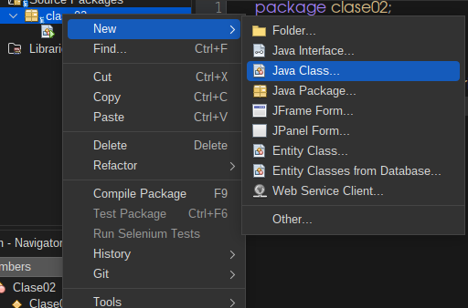
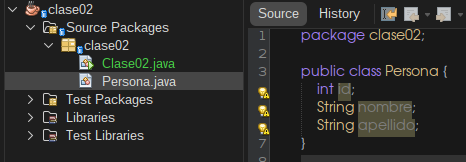

# Clase 2: Conceptos Fundamentales de la POO en Java

### 1. ¿Qué es una Clase en Java?

| Concepto | Descripción |
| :--- | :--- |
| **Definición** | Una clase es una **plantilla** o **molde** que define la estructura y el comportamiento de los objetos. |
| **Motivo de Uso** | Permiten modelar entidades del mundo real (ej. `Persona`, `Auto`) de forma organizada y reutilizable. |
| **Componentes** | Las clases poseen **Atributos** (datos) y **Métodos** (acciones). |
| **Importante** | Una clase no se puede utilizar directamente; es necesario crear una **instancia** (un objeto) de ella. |


### 2. Convenciones de Nomenclatura para Clases

Para mantener la legibilidad y seguir el estándar de Java (**Camel Case**):

* **Inicio:** El nombre de una clase siempre debe empezar con **mayúscula** (Convención estándar en Java).
* **Formato:** Si el nombre es compuesto, se usa *Camel Case* (ej: `MiPrimerClase`).
* **Número:** El nombre de la clase debe estar siempre en **singular** (ej: `Perro`, no `Perros`).

### 3. Creación de una Clase en NetBeans

Sigue estos pasos para añadir una nueva clase a tu proyecto:

1.  Hacer **clic derecho** sobre el paquete donde deseas ubicar la clase.
2.  Seleccionar el menú **`New`**.
3.  Elegir la opción **`Java Class...`**.
4.  Asignar el nombre, respetando las convenciones.


### 4. Ejemplo Práctico: Clase `Persona`

El siguiente ejemplo muestra la estructura básica de una clase `Persona` con tres atributos:

```java
public class Persona {

    // Atributos (Características) de la clase Persona

    public int id;
    public String nombre;
    public String apellido;

    // Aquí irían los métodos (comportamientos)
}
