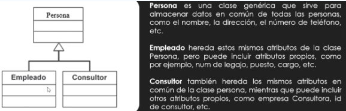

#  Clase 6: Herencia (Reutilización de Código)

La herencia es uno de los pilares de la POO que permite establecer una relación jerárquica entre clases, donde una clase puede adquirir las propiedades y el comportamiento de otra.

## 1. Concepto y Terminología

### Definición
La **Herencia** permite **reutilizar código**. Se crea una nueva clase que **extiende** la funcionalidad de una clase existente sin necesidad de reescribir sus atributos y métodos.

### Terminología

* **Clase Padre (o Superclase):** Es la clase existente, la que cede sus atributos y métodos. (Ejemplo: `Persona`).
* **Clase Hija (o Subclase):** Es la nueva clase que hereda las características de la Clase Padre. (Ejemplo: `Empleado` o `Consultor`).

### Relación Jerárquica

La imagen muestra que tanto `Empleado` como `Consultor` son tipos de `Persona`, heredando sus características comunes.



## 2. Lo que se Hereda y se Agrega

### ¿Qué se Hereda?

Los objetos de la Clase Hija (Subclase) heredan automáticamente:
1.  **Atributos** (características).
2.  **Métodos** (comportamiento).

### ¿Se pueden agregar nuevos atributos?

**Sí.** La Clase Hija puede tener sus propios atributos y métodos que no existen en la Clase Padre. Esto le permite especializarse.

* **Ejemplo:** `Empleado` hereda `nombre` y `apellido` de `Persona`, pero agrega sus propios atributos como `num_legajo`, `cargo` y `sueldo`.

```java
public class Empleado extends Persona {
    
    // Atributos propios de la Clase Hija
    int num_legajo;
    String cargo;
    Double sueldo;

    public Empleado() {
        // Constructor vacío
    }
    // ... más código
}
```
## 3. Identificación e Implementación en Java

### Identificación de Herencia

La herencia se identifica gráficamente con una flecha que va desde la **Clase Hija** hacia la **Clase Padre**.

### Implementación con `extends`

En Java, la herencia se declara utilizando la palabra clave **`extends`** en la declaración de la Clase Hija:

```java
public class Empleado extends Persona {
    // ...
}
```

## 4. El Constructor y la Palabra Clave `super`

Al crear un constructor en la Clase Hija, es obligatorio asegurar que los atributos de la Clase Padre también sean inicializados.

### Invocación del Constructor del Padre

Esto se logra utilizando la palabra clave **`super()`** dentro del constructor de la Clase Hija.

* **Funcionalidad de `super()`:** Llama al constructor de la **Clase Padre** (`Persona` en este caso) para inicializar sus atributos heredados.

### Ejemplo de Constructor con `super()`

El constructor de la Clase Hija (`Empleado`) recibe todos los parámetros (los propios y los heredados) y usa `super()` para inicializar la porción de la Clase Padre:

```java
public Empleado(int num_legajo, String cargo, Double sueldo, 
                int id, String dni, String nombre, String apellido, 
                String domicilio, String telefono) {
    
    // Llama al constructor de la Clase Padre (Persona)
    super(id, dni, nombre, apellido, domicilio, telefono);
    
    // Inicializa los atributos propios de la Clase Hija (Empleado)
    this.num_legajo = num_legajo;
    this.cargo = cargo;
    this.sueldo = sueldo;
}
```